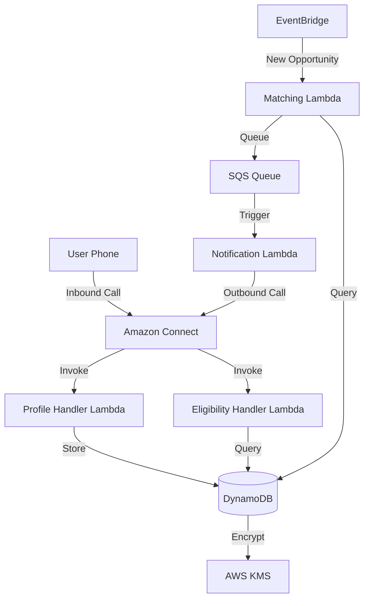

# Design Document: Naavik

## Overview

Naavik is a serverless, event-driven opportunity tracking system built on AWS that provides voice-first access to public opportunities. The system uses Amazon Connect for telephony, Lambda for compute, DynamoDB for storage, and EventBridge for event orchestration. The architecture prioritizes accessibility, scalability, and minimal data collection while enabling proactive user notifications.

### Key Design Principles

1. **Voice-First Accessibility**: All interactions designed for voice, with clear prompts and error handling
2. **Event-Driven Architecture**: Loosely coupled components communicating via events
3. **Serverless Scalability**: Auto-scaling compute and storage without infrastructure management
4. **Data Minimization**: Collect and retain only essential user information
5. **Proactive Engagement**: System-initiated outbound calls when opportunities match user profiles

## Architecture

### High-Level Architecture



### Component Overview

1. **Amazon Connect**: Managed contact center service handling inbound and outbound calls
2. **Lambda Functions**: Serverless compute for business logic
3. **DynamoDB**: NoSQL database for user profiles, opportunities, and alert registry
4. **EventBridge**: Event bus for decoupled component communication
5. **SQS**: Message queue for reliable notification delivery
6. **KMS**: Key management for data encryption
7. **CloudWatch**: Logging and monitoring

## Components and Interfaces

### 1. Voice Interface (Amazon Connect)

**Responsibilities:**
- Handle inbound calls from users
- Execute outbound calls for notifications
- Manage call flow and session state
- Integrate with Lambda functions for business logic
- Support multi-language prompts

**Contact Flows:**

**Inbound Flow:**
1. Greet user and prompt for language selection
2. Check if user has existing profile (via phone number lookup)
3. If new user: Route to profile registration flow
4. If existing user: Route to eligibility check flow
5. Maintain session state in Connect contact attributes

**Outbound Flow:**
1. Place call to user phone number
2. On answer: Play notification message with opportunity details
3. Offer to repeat information or connect to support
4. Log call outcome (answered, no-answer, busy)

**Interface:**
```python
# Lambda integration points
def handle_profile_registration(event):
    """
    Input: {
        'phone_number': str,
        'name': str,
        'age': int,
        'education': str,
        'location': str,
        'preferences': [str]
    }
    Output: {
        'success': bool,
        'user_id': str,
        'message': str
    }
    """

def handle_eligibility_check(event):
    """
    Input: {
        'user_id': str
    }
    Output: {
        'opportunities': [
            {
                'title': str,
                'deadline': str,
                'description': str,
                'application_url': str
            }
        ],
        'count': int
    }
    """

def handle_alert_registration(event):
    """
    Input: {
        'user_id': str,
        'register': bool
    }
    Output: {
        'success': bool,
        'message': str
    }
    """
```

### 2. Profile Handler Lambda

**Responsibilities:**
- Validate and sanitize user profile data
- Store profiles in DynamoDB
- Handle profile updates and deletions
- Implement retry logic for storage failures

**Implementation:**
```python
import boto3
import uuid
from datetime import datetime

dynamodb = boto3.resource('dynamodb')
users_table = dynamodb.Table('naavik-users')

def lambda_handler(event, context):
    action = event.get('action')
    
    if action == 'create':
        return create_profile(event)
    elif action == 'update':
        return update_profile(event)
    elif action == 'delete':
        return delete_profile(event)
    elif action == 'get':
        return get_profile(event)

def create_profile(event):
    user_id = str(uuid.uuid4())
    profile = {
        'user_id': user_id,
        'phone_number': event['phone_number'],
        'name': event['name'],
        'age': event['age'],
        'education': event['education'],
        'location': event['location'],
        'preferences': event['preferences'],
        'created_at': datetime.utcnow().isoformat(),
        'language': event.get('language', 'en')
    }
    
    # Retry logic with exponential backoff
    max_retries = 3
    for attempt in range(max_retries):
        try:
            users_table.put_item(Item=profile)
            return {
                'success': True,
                'user_id': user_id,
                'message': 'Profile created successfully'
            }
        except Exception as e:
            if attempt == max_retries - 1:
                return {
                    'success': False,
                    'message': f'Failed to create profile: {str(e)}'
                }
            time.sleep(2 ** attempt)

def delete_profile(event):
    user_id = event['user_id']
    try:
        users_table.delete_item(Key={'user_id': user_id})
        # Also delete from alert registry
        alerts_table = dynamodb.Table('naavik-alerts')
        alerts_table.delete_item(Key={'user_id': user_id})
        return {'success': True}
    except Exception as e:
        return {'success': False, 'message': str(e)}
```

### 3. Eligibility Engine Lambda

**Responsibilities:**
- Match user profiles against opportunity criteria
- Rank opportunities by deadline
- Filter expired opportunities
- Return formatted results for voice presentation

**Matching Algorithm:**
```python
def match_opportunities(user_profile, opportunities):
    """
    Match user profile against opportunity eligibility criteria.
    
    Matching rules:
    - Age: user age must be within opportunity age range
    - Education: user education must meet minimum requirement
    - Location: user location must be in opportunity's eligible locations
    - Category: opportunity category must match user preferences
    """
    matches = []
    
    for opp in opportunities:
        if is_expired(opp):
            continue
            
        if not check_age_eligibility(user_profile['age'], opp):
            continue
            
        if not check_education_eligibility(user_profile['education'], opp):
            continue
            
        if not check_location_eligibility(user_profile['location'], opp):
            continue
            
        if not check_category_match(user_profile['preferences'], opp):
            continue
            
        matches.append(opp)
    
    # Sort by deadline (earliest first)
    matches.sort(key=lambda x: x['deadline'])
    return matches

def check_age_eligibility(user_age, opportunity):
    min_age = opportunity.get('min_age', 0)
    max_age = opportunity.get('max_age', 150)
    return min_age <= user_age <= max_age

def check_education_eligibility(user_education, opportunity):
    education_levels = {
        'high_school': 1,
        'undergraduate': 2,
        'graduate': 3,
        'postgraduate': 4
    }
    required = education_levels.get(opportunity.get('min_education', 'high_school'), 1)
    user_level = education_levels.get(user_education, 1)
    return user_level >= required

def check_location_eligibility(user_location, opportunity):
    eligible_locations = opportunity.get('eligible_locations', [])
    if not eligible_locations or 'all' in eligible_locations:
        return True
    return user_location in eligible_locations

def check_category_match(user_preferences, opportunity):
    opp_categories = opportunity.get('categories', [])
    return any(pref in opp_categories for pref in user_preferences)
```


### 5. Matching Lambda

**Responsibilities:**
- Listen for new opportunity events
- Query alert registry for matching users
- Queue notification tasks to SQS

**Implementation:**
```python
def lambda_handler(event, context):
    """Triggered by EventBridge when new opportunity is published"""
    opportunity = json.loads(event['detail'])
    
    # Get all users from alert registry
    alerts_table = dynamodb.Table('naavik-alerts')
    response = alerts_table.scan()
    registered_users = response['Items']
    
    # Get user profiles
    users_table = dynamodb.Table('naavik-users')
    matching_users = []
    
    for alert in registered_users:
        user_response = users_table.get_item(Key={'user_id': alert['user_id']})
        if 'Item' in user_response:
            user = user_response['Item']
            if matches_criteria(user, opportunity):
                matching_users.append(user)
    
    # Queue notifications
    sqs = boto3.client('sqs')
    queue_url = os.environ['NOTIFICATION_QUEUE_URL']
    
    for user in matching_users:
        message = {
            'user_id': user['user_id'],
            'phone_number': user['phone_number'],
            'opportunity': opportunity,
            'language': user.get('language', 'en'),
            'attempt': 1
        }
        sqs.send_message(
            QueueUrl=queue_url,
            MessageBody=json.dumps(message)
        )
    
    return {
        'opportunity_id': opportunity['opportunity_id'],
        'matching_users': len(matching_users)
    }

def matches_criteria(user, opportunity):
    """Reuse eligibility engine logic"""
    return (
        check_age_eligibility(user['age'], opportunity) and
        check_education_eligibility(user['education'], opportunity) and
        check_location_eligibility(user['location'], opportunity) and
        check_category_match(user['preferences'], opportunity)
    )
```

### 6. Notification Lambda

**Responsibilities:**
- Process notification queue messages
- Initiate outbound calls via Amazon Connect
- Implement retry logic (up to 3 attempts over 24 hours)
- Log notification outcomes

**Implementation:**
```python
import boto3
from datetime import datetime, timedelta

connect = boto3.client('connect')
sqs = boto3.client('sqs')
dynamodb = boto3.resource('dynamodb')

CONNECT_INSTANCE_ID = os.environ['CONNECT_INSTANCE_ID']
OUTBOUND_CONTACT_FLOW_ID = os.environ['OUTBOUND_FLOW_ID']
MAX_ATTEMPTS = 3

def lambda_handler(event, context):
    """Triggered by SQS queue"""
    for record in event['Records']:
        message = json.loads(record['body'])
        process_notification(message, record)

def process_notification(message, sqs_record):
    user_id = message['user_id']
    phone_number = message['phone_number']
    opportunity = message['opportunity']
    attempt = message.get('attempt', 1)
    
    # Initiate outbound call
    try:
        response = connect.start_outbound_voice_contact(
            InstanceId=CONNECT_INSTANCE_ID,
            ContactFlowId=OUTBOUND_CONTACT_FLOW_ID,
            DestinationPhoneNumber=phone_number,
            Attributes={
                'opportunity_title': opportunity['title'],
                'opportunity_deadline': opportunity['deadline'],
                'opportunity_url': opportunity['application_url'],
                'language': message.get('language', 'en')
            }
        )
        
        # Log successful call initiation
        log_notification(user_id, opportunity['opportunity_id'], 'initiated', attempt)
        
        # Check call outcome after delay (handled by Connect)
        # Connect will invoke a separate Lambda to log final outcome
        
    except Exception as e:
        print(f"Error initiating call: {str(e)}")
        
        # Retry logic
        if attempt < MAX_ATTEMPTS:
            retry_notification(message, attempt + 1)
        else:
            log_notification(user_id, opportunity['opportunity_id'], 'failed', attempt)

def retry_notification(message, next_attempt):
    """Re-queue message with delay"""
    sqs = boto3.client('sqs')
    queue_url = os.environ['NOTIFICATION_QUEUE_URL']
    
    message['attempt'] = next_attempt
    delay_seconds = min(3600 * (2 ** (next_attempt - 1)), 43200)  # Max 12 hours
    
    sqs.send_message(
        QueueUrl=queue_url,
        MessageBody=json.dumps(message),
        DelaySeconds=delay_seconds
    )

def log_notification(user_id, opportunity_id, status, attempt):
    notifications_table = dynamodb.Table('naavik-notifications')
    notifications_table.put_item(Item={
        'notification_id': str(uuid.uuid4()),
        'user_id': user_id,
        'opportunity_id': opportunity_id,
        'status': status,
        'attempt': attempt,
        'timestamp': datetime.utcnow().isoformat()
    })
```

## Data Models

### User Profile

```python
{
    'user_id': str,              # UUID, partition key
    'phone_number': str,         # E.164 format, GSI partition key
    'name': str,
    'age': int,
    'education': str,            # Enum: high_school, undergraduate, graduate, postgraduate
    'location': str,             # State or city
    'preferences': [str],        # List of opportunity categories
    'language': str,             # ISO 639-1 code (en, hi)
    'created_at': str,           # ISO 8601 timestamp
    'updated_at': str            # ISO 8601 timestamp
}
```

**DynamoDB Table: naavik-users**
- Partition Key: user_id
- GSI: phone_number-index (for lookup by phone)
- Encryption: KMS with customer-managed key
- TTL: None (user-controlled deletion)

### Opportunity

```python
{
    'opportunity_id': str,       # UUID, partition key
    'title': str,
    'description': str,
    'deadline': str,             # ISO 8601 date
    'application_url': str,
    'min_age': int,
    'max_age': int,
    'min_education': str,
    'eligible_locations': [str],
    'categories': [str],
    'source': str,               # Source website
    'published_at': str,         # ISO 8601 timestamp
    'scraped_at': str            # ISO 8601 timestamp
}
```

**DynamoDB Table: naavik-opportunities**
- Partition Key: opportunity_id
- GSI: deadline-index (for querying active opportunities)
- GSI: title-deadline-index (for deduplication)
- TTL: deadline + 30 days (auto-cleanup)

### Alert Registry

```python
{
    'user_id': str,              # Partition key
    'registered_at': str,        # ISO 8601 timestamp
    'active': bool
}
```

**DynamoDB Table: naavik-alerts**
- Partition Key: user_id
- No GSI needed (scan for matching)

### Notification Log

```python
{
    'notification_id': str,      # UUID, partition key
    'user_id': str,              # GSI partition key
    'opportunity_id': str,
    'status': str,               # Enum: initiated, delivered, failed, no_answer
    'attempt': int,
    'timestamp': str             # ISO 8601 timestamp
}
```

**DynamoDB Table: naavik-notifications**
- Partition Key: notification_id
- GSI: user_id-timestamp-index (for user notification history)
- TTL: timestamp + 90 days

## Correctness Properties


*A property is a characteristic or behavior that should hold true across all valid executions of a system—essentially, a formal statement about what the system should do. Properties serve as the bridge between human-readable specifications and machine-verifiable correctness guarantees.*

### Property 1: Profile Data Round-Trip

*For any* complete user profile, storing the profile and then retrieving it by user_id should return an equivalent profile with all fields preserved.

**Validates: Requirements 1.2, 1.4**

### Property 2: Opportunity Data Round-Trip

*For any* valid opportunity with all required fields, storing the opportunity and then retrieving it by opportunity_id should return an equivalent opportunity with all fields preserved.

**Validates: Requirements 4.2, 4.4**

### Property 3: Incomplete Profile Validation

*For any* profile missing one or more required fields (name, age, education, location, preferences), the validation function should identify all missing fields and return them in the validation result.

**Validates: Requirements 1.3**

### Property 4: Opportunity Field Validation

*For any* opportunity data, validation should verify that all required fields (title, description, deadline, application_url) are present and non-empty, returning false for any incomplete opportunity.

**Validates: Requirements 4.3**

### Property 5: Eligibility Matching Completeness

*For any* user profile and set of opportunities, the eligibility engine should evaluate every opportunity in the set and return all opportunities where age, education, location, and category criteria are satisfied.

**Validates: Requirements 2.1, 2.2, 5.1**

### Property 6: Deadline Sorting Invariant

*For any* list of matching opportunities, the ranked results should be sorted by deadline in ascending order, where for any two adjacent opportunities in the list, the first has an earlier or equal deadline to the second.

**Validates: Requirements 2.5**

### Property 7: Opportunity Presentation Completeness

*For any* opportunity in the eligibility results, the formatted output should contain the opportunity name, deadline, and application method as substrings.

**Validates: Requirements 2.4**

### Property 8: Alert Registry Persistence

*For any* user accepting alert registration, adding them to the Alert_Registry should result in a retrievable record that includes their user_id and eligibility criteria.

**Validates: Requirements 3.2, 3.3**

### Property 9: Retry Behavior with Exponential Backoff

*For any* operation that fails, the retry mechanism should attempt the operation up to the configured maximum attempts (3), with delays following exponential backoff (2^attempt seconds), and should stop after the maximum is reached.

**Validates: Requirements 1.6, 5.3, 8.3**

### Property 10: Notification Queue Completeness

*For any* new opportunity and set of registered users, all users whose profiles match the opportunity criteria should have notification messages queued, with one message per matching user.

**Validates: Requirements 5.2**

### Property 11: Notification Delivery State Update

*For any* successfully delivered notification, the system should record a delivery timestamp and the user should no longer appear in the notification queue for that specific opportunity.

**Validates: Requirements 5.6**

### Property 12: Outbound Call Content Completeness

*For any* notification call message, the content should include the opportunity name, deadline, and application method as required fields.

**Validates: Requirements 5.4**

### Property 13: Input Prompt Instruction Presence

*For any* voice prompt requesting user input, the prompt text should contain explicit instructions indicating the expected input format or available options.

**Validates: Requirements 6.3**

### Property 14: Unclear Input Re-prompting

*For any* user input that fails validation or cannot be understood, the system should re-prompt with the same question plus additional clarification text.

**Validates: Requirements 6.4**

### Property 15: Minimum Data Collection

*For any* profile creation request, the system should collect only the fields defined in the profile schema (name, age, education, location, preferences, phone_number, language) and should reject or ignore any additional fields.

**Validates: Requirements 7.1**

### Property 16: Profile Deletion Completeness

*For any* user deletion request, all records associated with that user_id should be removed from all tables (users, alerts, notifications) within the deletion operation.

**Validates: Requirements 7.4**

### Property 17: Error Logging Invariant

*For any* exception or error that occurs during operation, the system should create a log entry containing the error message, timestamp, and context information before propagating or handling the error.

**Validates: Requirements 8.5**

### Property 18: Language Consistency

*For any* call session with a selected language, all voice prompts and opportunity content presented during that session should be in the selected language.

**Validates: Requirements 9.3, 9.5**

### Property 19: Session State Persistence

*For any* call session that is disconnected, the session state should be retrievable by session_id for at least 30 minutes after disconnection.

**Validates: Requirements 10.2**

### Property 20: Session Cleanup on Completion

*For any* call session that completes successfully, the session state should be cleared from active storage and a completion log entry should be created.

**Validates: Requirements 10.5**

### Property 21: Invalid Data Error Resilience

*For any* batch of opportunities being processed, if one opportunity has invalid data, the system should log the error for that opportunity and continue processing the remaining opportunities in the batch.

**Validates: Requirements 4.5**

## Error Handling

### Error Categories

1. **Validation Errors**: Invalid or incomplete user input
   - Return clear error messages via voice interface
   - Re-prompt user with clarification
   - Log validation failures for monitoring

2. **Storage Errors**: DynamoDB write/read failures
   - Implement exponential backoff retry (3 attempts)
   - Return user-friendly error message after exhausting retries
   - Alert monitoring system for persistent failures

3. **External Service Errors**: Scraping failures, Connect API errors
   - Log error with full context
   - Continue processing other items in batch
   - Implement circuit breaker for repeated failures

4. **Timeout Errors**: Lambda timeouts, API timeouts
   - Set appropriate timeout values (Lambda: 30s, API calls: 10s)
   - Implement graceful degradation
   - Return partial results when possible

### Error Response Format

```python
{
    'success': False,
    'error_code': str,        # Machine-readable error code
    'error_message': str,     # Human-readable message
    'retry_after': int,       # Seconds to wait before retry (optional)
    'context': dict           # Additional error context
}
```

### Monitoring and Alerting

- CloudWatch alarms for error rate thresholds
- Dead letter queues for failed SQS messages
- X-Ray tracing for distributed request tracking
- Custom metrics for business logic errors

## Testing Strategy

- Unit testing for eligibility and profile logic
- Integration testing using AWS test events
- Manual testing of call flows in Amazon Connect
- Validation of event-driven workflows through EventBridge

Testing focuses on verifying eligibility matching, notification triggering, and voice interaction flows.

## Deployment and Infrastructure

### AWS Services Configuration

**Amazon Connect**:
- Instance with inbound/outbound calling enabled
- Contact flows for registration, eligibility, and notifications
- Lambda integration for business logic
- Call recording disabled (privacy)

**Lambda Functions**:
- Runtime: Python 3.11
- Memory: 512 MB (adjust based on profiling)
- Timeout: 30 seconds
- VPC: Not required (using AWS services only)
- Environment variables for configuration

**DynamoDB**:
- On-demand billing mode for variable traffic
- Point-in-time recovery enabled
- Encryption with customer-managed KMS key
- Global secondary indexes as specified in data models

**EventBridge**:
- Scheduled rule for scraper (daily at 6 AM IST)
- Event rule for new opportunities
- Dead letter queue for failed events

**SQS**:
- Standard queue for notifications
- Visibility timeout: 5 minutes
- Message retention: 4 days
- Dead letter queue after 3 receive attempts

**CloudWatch**:
- Log retention: 30 days
- Custom metrics for business events
- Alarms for error rates and latency

### Infrastructure as Code

Use AWS CDK (Python) or Terraform for infrastructure provisioning:
- Separate stacks for compute, storage, and networking
- Environment-specific configurations (dev, staging, prod)
- Automated deployment pipeline with testing gates

### Security Considerations

- IAM roles with least privilege principle
- KMS encryption for data at rest
- TLS 1.2+ for data in transit
- VPC endpoints for AWS service access (optional)
- Secrets Manager for API keys and credentials
- CloudTrail for audit logging

## Future Enhancements

1. **SMS Notifications**: Add SMS as alternative to voice calls
2. **Web Portal**: Self-service portal for profile management
3. **Advanced Matching**: ML-based opportunity recommendations
4. **Multi-Channel**: WhatsApp, Telegram integration
5. **Analytics Dashboard**: User engagement and opportunity metrics
6. **Feedback Loop**: Collect user feedback on opportunities
7. **Regional Language Expansion**: Support for more Indian languages
